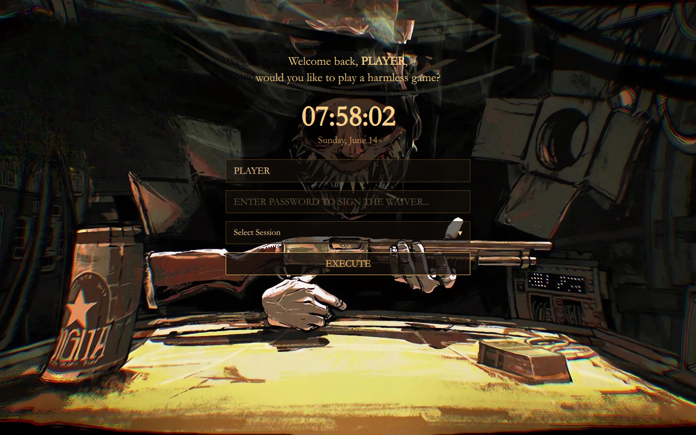

# Harmless Game SDDM Theme 🎲🔫

Language: [English](README.md) | [Русский](README_RU.md)

An atmospheric, high-stakes login theme for SDDM, styled after the gritty aesthetics of **Buckshot Roulette**. It features a clean, centered layout with classic Garamond typography, zero bloated dependencies, and a custom-tailored color palette extracted straight from the Dealer's table.

Designed to make you sign the waiver and test your luck every time you boot up your Linux system.

---

## ✨ Features

- 🎭 **Buckshot Roulette Aesthetic:** A raw, immersive palette of deep cigarette-powder grays and rusty game-gold accents.
- 🎛️ **Custom Session Dropdown:** A fully customized, bug-free centered overlay menu for seamlessly selecting Window Managers or Desktop Environments (Hyprland, Plasma, Sway, etc.).
- 🖋️ **Classic Typography:** Integrated polished `Garamond` typography across all interfaces for a vintage, high-stakes document look.
- 🕒 **Live Clock:** Real-time ticking clock with a localized date indicator.
- 👤 **Smart Username Fallback:** Remembers the last logged-in user or gracefully falls back to a default `PLAYER` profile.
- ⚡ **Zero Bloat:** Completely native Qt6 code. No heavy or broken external graphical effects modules required.

---

## 📸 Preview



---

## 📂 Installation

### 1. Manual Installation

Clone this repository or download the ZIP archive and copy the folder directly into your system's SDDM themes directory:

```bash
# Clone the repository
git clone https://github.com/neverloseagain1/Harmless-Game-SDDM-Theme

# Move the theme directory to system SDDM themes folder with the correct name
sudo cp -r Harmless-Game-SDDM-Theme/ /usr/share/sddm/themes/Harmless-Game
```

### 2. Enable the Theme

Edit your system's SDDM configuration file (usually found at `/etc/sddm.conf` or `/etc/sddm.conf.d/theme.conf`). Set the current theme under the `[Theme]` section:

```ini
[Theme]
Current=Harmless-Game
```

---

## ⚙️ Configuration

You can easily tweak colors, fonts, and backgrounds by editing the `theme.conf` file inside the theme directory:

```ini
[General]
# Color palette in HEX format (Dealer's Table & High-Stakes)
ColorLight="#D4A359"
ColorDark="#120C0A"
ColorAccent="#C2913F"
ColorInputBg="#140F0A"

# Font configurations
Font="Garamond"
FontSize="22"

# Path to your background image
Background="backgrounds/background.jpg"
```

---

## 🛠️ Testing Without Reboot

You can preview and test how the theme looks live on your screen without logging out by running the following command in your terminal:

```bash
sddm-greeter --test-mode --theme /usr/share/sddm/themes/Harmless-Game
```
